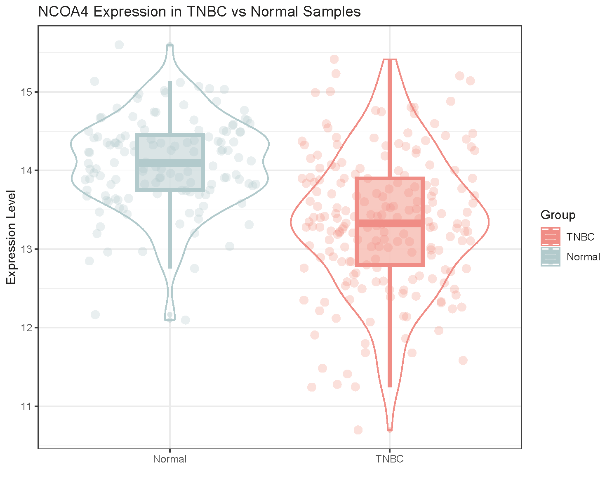
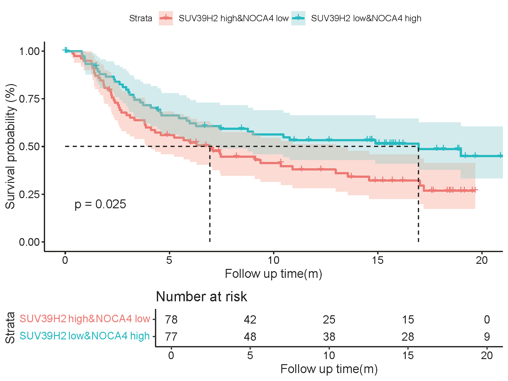

# TNBC Project Overview

本页面简要介绍 TNBC（Triple-Negative Breast Cancer）分析的生物信息学流程、数据来源以及主要可视化结果。

## 📊 数据来源

- **TCGA-BRCA数据库和METABRIC 数据库**（乳腺癌及正常乳腺组织表达谱数据）

- 使用经过标准化处理的表达矩阵进行后续分析

## 🧬 分析流程

- 数据导入与质量控制

- 分组（TNBC vs Normal）

- 基因表达差异可视化（violin plot）

- 生存分析：Kaplan–Meier 曲线（根据基因表达高低分组）

- 

## 🖼️ 主要结果展示

以下为 TNBC 中关键基因表达差异与生存分析的可视化结果示例：

### ● 基因表达差异（TNBC vs Normal）

  

### ● 生存分析：联合基因分组

  

---

Last updated: {{ git_revision_date }}
