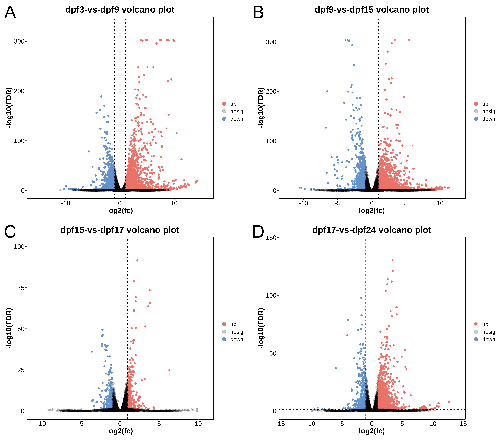
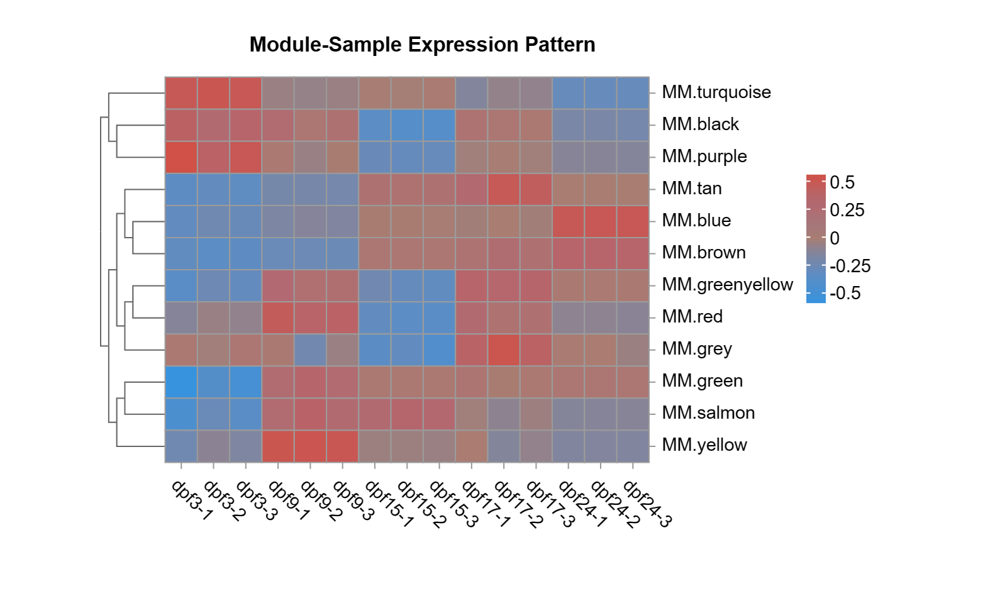

# North African Catfish Early Development Transcriptome (black project)

> Deep transcriptome analyses reveal dynamic developmental processes during early development of the North African catfish (Clarias gariepinus)

---

## 1. 项目概览（Project Overview）

- 物种：尖齿胡鲶 *Clarias gariepinus*，典型空气呼吸鱼类。

- 目标：解析 5 个早期发育阶段（3, 9, 15, 17, 24 dpf）的转录组动态，识别与**胚胎发育、免疫成熟及气体交换适应**相关的关键基因及通路。

- 技术路线：全转录组 RNA-Seq → 差异表达分析 → GO/KEGG 富集 → 趋势分析（STEM）→ WGCNA 共表达网络 → PPI 枢纽基因识别。

---

## 2. 采样与测序设计（Sampling & RNA-Seq）

- 阶段：3, 9, 15, 17, 24 dpf

- 每阶段：3 个平行重复，MS-222 麻醉后整体胚胎 / 幼体冷冻保存

- 平台：Illumina（HiSeq 4000），Trizol 提取 + NEBNext 文库制备。

- 质控及比对：
  
  - fastp 过滤低质量 reads
  
  - Bowtie2 去 rRNA
  
  - HISAT2 比对至尖齿胡鲶参考基因组
  
  - StringTie 转录本重构，RSEM 计算表达量（RPKM）

---

## 3. 全局转录组特征（Global Transcriptome Features）

- 总数据量：约 10 亿条原始 reads，经质控后保留 ~6.6 亿高质量 reads。

- 比对及注释：
  
  - 对参考基因组比对后，鉴定到 **25,508 个基因**，其中在所有阶段共表达基因约 22,931 个。
  
  - StringTie 发现 **约 1,211 个潜在新基因**。

- 不同发育阶段表达基因数在 3–15 dpf 逐渐增加，17/24 dpf 略有回落，提示早期器官形成与系统发育高峰期。

---

## 4. 变异注释（SNP/InDel Annotation）

- SNP/InDel 功能与位点：
  
  - 同义 SNP 最多，其次为非同义 SNP → 说明大部分变异对蛋白序列影响有限，但仍存在一部分可能改变蛋白功能的变异。
  
  - 变异主要位于 **内含子区、非编码区及上下游调控区域**，少数位于外显子。

- 突变类型：
  
  - transition 数量略高于 transversion，C>T / G>A 占主导，与胞嘧啶脱氨等机制一致。
  
  - InDel 中，可能引起移码的事件在功能层面具有潜在重要性。

---

## 5. 差异表达与功能富集（DEGs & Functional Enrichment）

- 比较组：
  
  - 3 vs 9 dpf
  
  - 9 vs 15 dpf
  
  - 15 vs 17 dpf
  
  - 17 vs 24 dpf

- 主要趋势：
  
  - **3→9 dpf**：上调基因 4,000+，下调约 1,400，反映早期快速增殖与组织建立。
  
  - **9→15 dpf**：上调减少，下调略增，发育过程部分趋稳，新的过程启动。
  
  - **15→17 dpf**：上调基因急剧增加至 ~6,400，提示关键发育转折点，可能涉及空气呼吸相关结构/功能建立。
  
  - **17→24 dpf**：DEG 总量下降，表达模式进入相对稳定和成熟阶段。

- GO 富集：
  
  - 3 vs 9 dpf：细胞外基质 / 细胞外空间、生物黏附等 → 组织建构与细胞间连接。
  
  - 9 vs 15 dpf：DNA 修复、核苷酸切除修复、免疫系统过程 → 遗传稳定性与初始免疫建立。
  
  - 15 vs 17 dpf：内质网、脂质转运 → 蛋白加工与脂质代谢强化。
  
  - 17 vs 24 dpf：T 细胞激活、细胞因子活性、淋巴细胞激活等免疫相关 GO 术语占主导 → 免疫系统成熟。

- KEGG 富集：
  
  - 早期（3–9 dpf）：蛋白消化吸收、固醇生物合成、胆汁分泌 → 消化与内分泌系统建立。
  
  - 中期（9–17 dpf）：细胞因子-受体相互作用、抗原呈递、TCR 通路、ER 蛋白加工 → 免疫调控与蛋白质稳态。
  
  - 晚期（17–24 dpf）：细胞黏附分子、自身免疫相关通路出现 → 免疫识别与自我组织识别能力增强。

---

## 6. 趋势分析（Time-series Expression Profiles）

使用 STEM 对 5 个阶段的连续表达模式聚类，得到若干显著 Profile，其中重点关注 3 类趋势：

- **Profile 19：持续上升型**
  
  - 富集：细胞过程、单细胞过程、生物调节过程，及免疫相关 KEGG 通路（细胞因子-受体、病毒感染、自身免疫疾病等）。
  
  - 解释：与免疫系统逐步建立和成熟高度相关。

- **Profile 0：持续下降型**
  
  - 富集：代谢过程、神经发育及多种神经退行性疾病相关通路，以及 Wnt / Hippo / GABAergic 等信号通路。
  
  - 解释：早期神经系统建构相关基因在后期逐渐下调，完成初始网络搭建后“退场”。

- **Profile 18：先升高-后稳定-再下降**
  
  - 富集：消化系统、代谢通路（胰腺分泌、胃酸分泌、蛋白质消化吸收）、ECM-受体相互作用等。
  
  - 解释：支撑快速生长和营养需求的功能在中期达到高峰，随后随个体成熟而减弱。

---

## 7. WGCNA 共表达模块与枢纽基因（Co-expression Modules & Hub Genes）

- 基于 ~9,454 个 DEGs / 15,105 个基因构建加权共表达网络。

- 软阈值选取保证 scale-free 网络特性，识别出 **12 个模块**（颜色编码）。

- 模块-阶段关联：
  
  - 绿松石（turquoise）& 紫色（purple）：3 dpf 高表达，提示早期细胞周期控制、DNA 修复和信号传导。
  
  - 绿色（green）：与 3 dpf 负相关，富集代谢与能量产生，反映能量代谢重编程。
  
  - 黄色（yellow）：9 dpf 特异，标记中期特定代谢与 ECM 相关过程。
  
  - 棕褐色（tan）/ 棕褐相关模块：17 dpf 相关，涉及细胞周期、凋亡与免疫信号。
  
  - 蓝色（blue）：24 dpf 相关，指向后期免疫与组织结构维持。

- Hub 基因示例：
  
  - Turquoise：**EVLB, ATP1B3B, NELL2, SNAP91** → 神经发育、膜蛋白及囊泡转运。
  
  - Green：**SLC35G2, STMN4, LIN7B, DSE** → 能量代谢、细胞骨架与 ECM 相关。
  
  - Purple / Yellow / Tan / Blue：包含 RBP1, MOV10B.2, ZAP70 等与代谢调控、抗病毒应答和免疫信号相关的基因。

---

## 8. 生物学启示与资源价值（Biological Insights & Resource Value）

- 本研究系统描绘了尖齿胡鲶从 3–24 dpf 的转录组轨迹，揭示：
  
  - 早期阶段：神经系统构建、基础代谢高负载及细胞周期/基因组稳定性维护。
  
  - 中期：免疫系统逐步激活，ER 蛋白加工、抗原呈递通路串联起发育与防御。
  
  - 后期：免疫相关通路明显富集，细胞黏附与 ECM 相关基因参与组织重塑与功能成熟。

- 对理解 **空气呼吸适应、低氧环境生存策略** 及 **鱼类早期发育的免疫与代谢调控** 具有重要参考意义。

- 提供了：
  
  - 高质量早期发育转录组资源（>25k 基因，>1k 新基因）
  
  - 多个与发育阶段强相关的共表达模块及枢纽基因
  
  - 可进一步整合形态学、功能实验和环境胁迫数据的基础框架。

---
